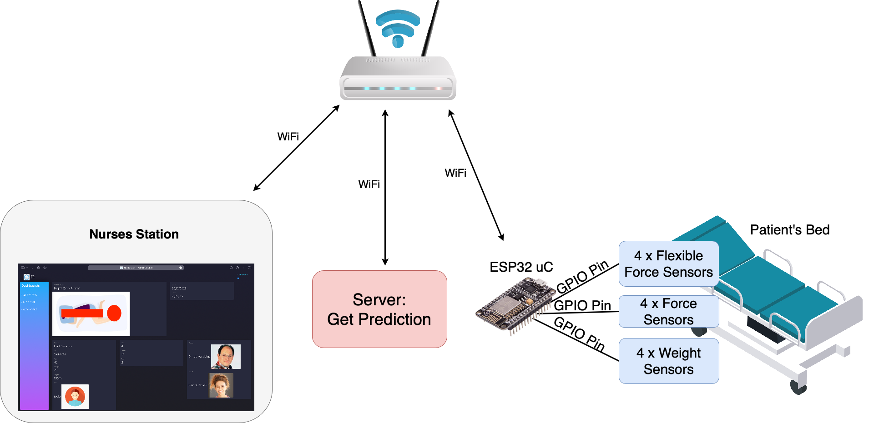
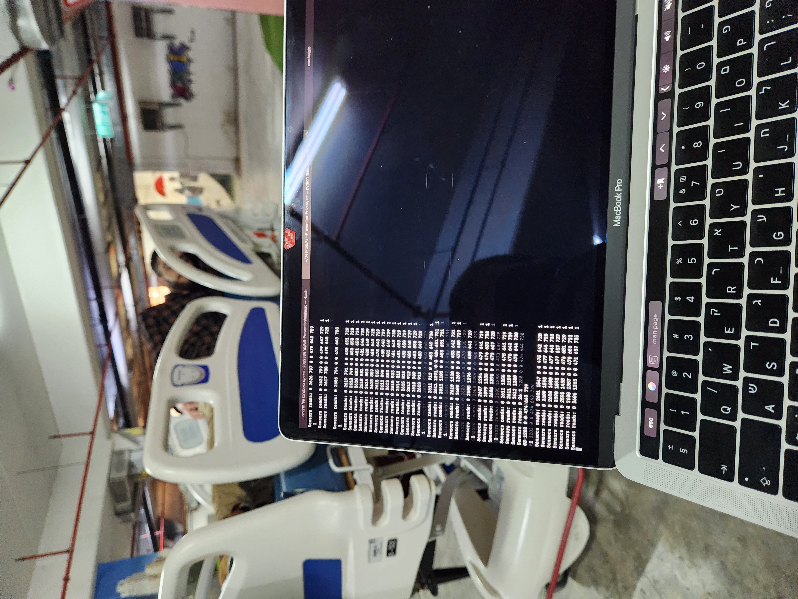
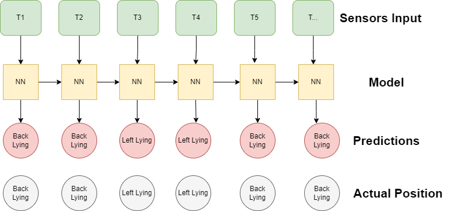

<h1 align="center">Fall Prevention</h1>
<h3 align="center">IoT Course</h3>

## Description
An IOT project to prevent patients (with temporary neurological disability) from falling out of bed in hospitals.
Using Machine Learning, we aim to predict whenever a patient is about to fall from his bed and give an appropriate warning to the medical staff.
A simple and smart UI will also be added to the system.
We use weight and pressure sensors to build our dataset and to collect data in real time.

Hardware Design           |  System Design 
:-------------------------:|:-------------------------:
  |  

Sensors Layout          |  Collecting the Data
:-------------------------:|:-------------------------:
  |  

Software Design      |  Nurses Station Website
:-------------------------:|:-------------------------:
 |  

Convolutional Neural Network    | Recurrent Neural Network
:-------------------------:|:-------------------------:
 |  
